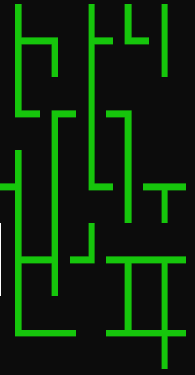

# pipes-cli

- Performance optimized cross-platform (Windows, Linux) console game made in C.

### Game objective

- Rotate pipes to create a path from the starting point to the finish.

### How to play

- WASD for movement
- SPACE for rotating pipe
- Q to quit

#### gameplay:

### Key Takeaways

Throughout the development process, I gained insights into:

- Console Manipulation
  - Moving the cursor
  - Replacing characters
- Cross-Platform Development
